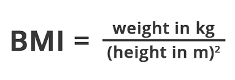

# Oefeningen labo 13

Zorg dat je de volgende folder structuur volgt:

```
webtechnologie/
├─ labo-01/
│  ├─ oefening-01/
│  │  ├─ index.html
│  │  ├─ images/
│  │  │  ├─ image-1.jpg 
│  │  │  └─ image-n.jpg 
│  │  ├─ css/
│  │  │   ├─ reset.css
│  │  │   └─ style.css
│  │  └─ js/
│  │     └─ script.js
│  ├─ oefening-02/
│  └─ oefening-n/
├─ labo-02/
└─ labo-n/      
```

- Gebruik steeds JS modules om globale variabelen te vermijden (`<script type="module" src="./path/to/script.js" defer></script>`)
- Zet je Javascript file steeds in strict mode (`"use strict"`);
- Volg de [Coding Guidelines](https://apwt.gitbook.io/webtechnologie/coding-guidelines)

## oefening 1: hello world!

### leerdoelen

* een eigen JS-script kunnen uitvoeren in de browser
* console.log gebruiken

### functionele analyse
Het script gaat in de console van de browser de tekst `Hello world!` weergeven.

### technische analyse
Maak een script.js-bestand aan. Koppel dit bestand aan jouw HTML-pagina (index.html) door middel van het `<script>`-element.

Maak een variabele aan met daarin de tekst "Hello world!".

Gebruik een `console.log`-statement om de inhoud van de variabele uit te lezen in de console van de browser.

### voorbeeldinteractie


## oefening 2: teksten uitlezen

### Leerdoelen

* console.log gebruiken
* string expressies

### functionele analyse
Het programma laat de informatie van de programmeur (jouw eigen informatie) zien in de console.

### technische analyse
Plaats jouw naam, leeftijd, e-mailadres en klasgroep in een variabele.

Gebruik vier `console.log`-statements om de informatie van de programmeur te laten zien in de console.

Tip: Gebruik string-manipulatie om de voorvoegsels (de woorden naam, leeftijd, e-mail en klasgroep) voor de variabele te plaatsen.

### voorbeeldinteractie


## oefening 3: getallen uitlezen

### Leerdoelen

* console.log gebruiken
* getallen gebruiken

### functionele analyse
Het programma laat de berekende leeftijd van de programmeur (jouw eigen informatie) zien in de console.

### technische analyse
Plaats jouw **geboortejaar** in een variabele.

Bereken jouw leeftijd o.b.v. het jaartal van dit jaar en de inhoud van de variabele. Het is niet erg als je er een jaar naast zit omdat je dit jaar nog moet verjaren.

Lees enkel het resulaat uit met 1 `console.log`-statement.

### voorbeeldinteractie


## oefening 4: BMI berekenen

### leerdoelen

* werken met variabelen
* expressies toevoegen
* console.log gebruiken

### functionele analyse
BMI berekenen aan de hand van hoogte en gewicht

### technische analyse
Maak een variabele `myWeight` en `myLength` waar je het gewicht in kg en de lengte in meter bijhoudt. Maak vervolgens een variabele `myBmi` met de waarde van je BMI. Je rekent deze als volgt uit:



Je kan een getal afronden door [Number.toFixed()](https://developer.mozilla.org/en-US/docs/Web/JavaScript/Reference/Global_Objects/Number/toFixed) te gebruiken (bv. result.toFixed(2)).

### voorbeeldinteractie
[voorbeeldinteractie](./voorbeeldinteractie-bmi.avif)

## oefening 5: bmi-namen

### leerdoelen

* variabelen
* expressies
* string expressies
* console.log

### functionele analyse
BMI berekenen aan de hand van hoogte en gewicht voor twee personen

### technische analyse
Pas de oefening over BMI aan zodat er een gewicht en een lengte variabele bestaat voor twee verschillende personen. Maak ook een variabele aan die de naam van de persoon bevat.

Toon de naam van de persoon met zijn bijbehorende BMI op het scherm.

### voorbeeldinteractie


## oefening 6: bmi-namen uitbreiding

### leerdoelen

* `Number.toFixed()` gebruiken

### functionele analyse
Het programma rondt de BMI af tot een geheel getal

### technische analyse
Kopieer jouw oplossing van de vorige oefening.

Zorg ervoor dat de BMI deze keer afgerond is door `Number.toFixed()` te gebruiken.

### voorbeeldinteractie


## oefening 7: interest

### leerdoelen

* stringinterpolatie
* machtsverheffing

### functionele analyse
Je programma toont hoe veel je huidig bezit waard zal zijn over een vast aantal jaar, indien je een vaste rentevoet toepast.

### technische analyse
In je programma hou je je startbezit bij, de rentevoet en het aantal jaren. Je mag deze getallen in je code zetten.

De rentevoet bepaalt met welke hoeveelheid je bezit op een jaar stijgt. Bijvoorbeeld, als je rentevoet 2% is en je startbedrag is 100 euro:

* na één jaar bezit je 102 euro (er is 2% van 100 bij gekomen)
* na twee jaar bezit je 104,04 euro (er is 2% van 102 bij gekomen)
* enzovoort

Rond het eindbedrag af naar een geheel getal.

**Hint**: eindsaldo = startsaldo \* ( 1 + rente)^looptijd

### voorbeeldinteractie


## oefening 8: uren

### leerdoelen

* gebruik maken van modulo

### functionele analyse
Je programma werkt als de kleine wijzer van een klok.

### technische analyse
In je programma maak je twee variabelen: één voor het huidige uur, één voor het aantal uur dat je hierbij wil optellen. Je hoeft hierbij de systeemklok niet te raadplegen. Vul gewoon een uur naar keuze in.

Je programma toont dan hoe laat het zal zijn als je de som maakt.

Let op: de klok telt maar 24 uur. Wat doe je als je hierboven gaat?

### voorbeeldinteractie


## oefening 9: wisselgeld

### Leerdoelen

* const gebruiken
* Math.ceil gebruiken
* expressies
* stringinterpolatie

### functionele analyse
Je programma geeft weer hoeveel briefjes van 50 euro je nodig hebt om een bepaald bedrag te kunnen betalen. Het geeft ook weer wat het wisselgeld dan is.

### technische analyse
Maak een constante `amountToPay` aan dat het te betalen bedrag bevat.

Bereken het aantal briefjes dat nodig is door het te betalen bedrag te delen door 50 en dit naar boven af te ronden. Zet het resultaat in een nieuwe constante `numberOf50s`.

**Hint:** Zoek even op het internet op hoe je getallen naar boven en naar beneden afrondt!

Bereken het wisselgeld en plaats het in een 3de constante `change`.

Print deze waarden af gebruikmakende van stringconcatenatie of stringinterpolatie.

### voorbeeldinteractie


## oefening 10: lotto

### leerdoelen

* functionaliteit van strings (substring, replaceAll)

### functionele analyse
Haal de lottocijfers uit een tekst en geef ze op een overzichtelijke manier weer (gescheiden door een pipe-symbool `|`).

```javascript
let text =
  "De winnende lottonummers van deze week: 05,09,13,18,27,44. Proficiat aan alle deelnemers.";
```

### technische analyse
Haal alle lottonummers uit bovenstaande tekst en zet ze in de varabele `lottoNumbers`.

Vervang de komma's door het pipe-symbool | en zet deze output in de variabele `formattedLottoNumbers`. Log vervolgens deze variabele. Je mag veronderstellen dat de cijfers genoteerd zijn zoals in het voorbeeld (met leidende `0` indien kleiner dan 10).

### voorbeeldinteractie


## oefening 11: name-from-mail

### leerdoelen

* functionaliteit van strings (substring, indexOf, replace, toUpperCase)
* string-interpolatie

### Functionele analyse
Het programma toont het gedeelte van de e-mailadres dat de naam voorstelt.

### technische analyse
Het e-mailadres kan je in een variabele `email` plaatsen.

We veronderstellen dat de variabele een juist e-mailadres bevat. Het e-mailadres zal zich altijd in het ap.be domein bevinden.

### voorbeeldinteractie


## oefening 12: short-name

### leerdoelen

* functionaliteit van strings (indexOf, replace)
* string-interpolatie

### functionele analyse
Je programma toont je voor en achternaam. Je voornaam moet afgekapt worden zodat enkel de eerste letter zichtbaar is. Achter deze letter moet een punt komen.

Voor- en achternaam moeten getoond met in het begin een hoofdletter.

### technische analyse
Je voorziet twee variabelen voor voor- en achternaam. Daarna zorg je ervoor dat je enkel de eerste letter van de voornaam zichtbaar is.

Let er op dat de variabelen ook zonder hoofdletters kunnen ingegeven worden.

Je kan deze string opbouwen aan de hand van stringinterpolatie.

### voorbeeldinteractie


## oefening 13: text-box

### leerdoelen

* functionaliteit strings (replace)
* escapen van bepaalde karakters

### functionele analyse
Je programma toont een stuk tekst in je console in een tekstvak

### technische analyse
Je plaatst het stuk tekst in een variabele genaamd `text`.

Maak met de karakters `/` - en `\` een tekstvak.

Het stuk tekst moet altijd in het tekstvak passen. Je kan de lengte opvragen van de variabele tekst en er voor zorgen dat de karakters herhaald worden.

Zorg ervoor dat je maar 1 console.log statement gebruikt. Je zal dus moeten gebruik maken van newlines.

### voorbeeldinteractie

